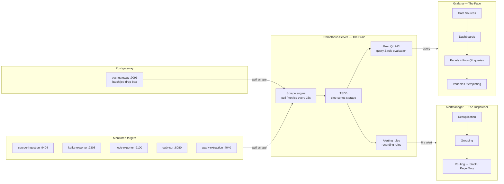
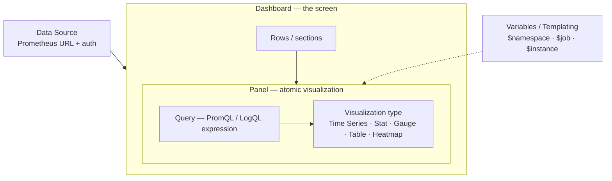
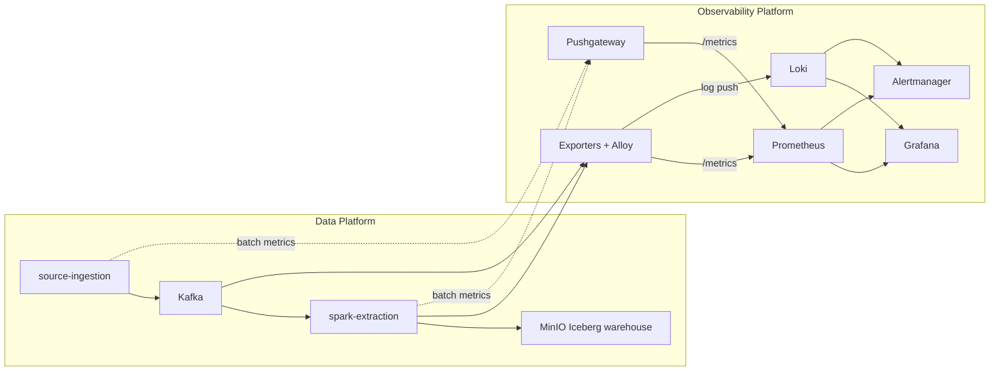
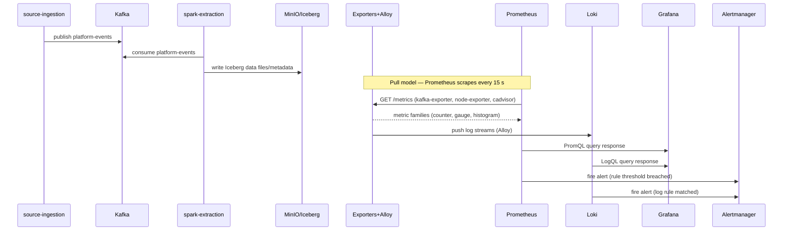
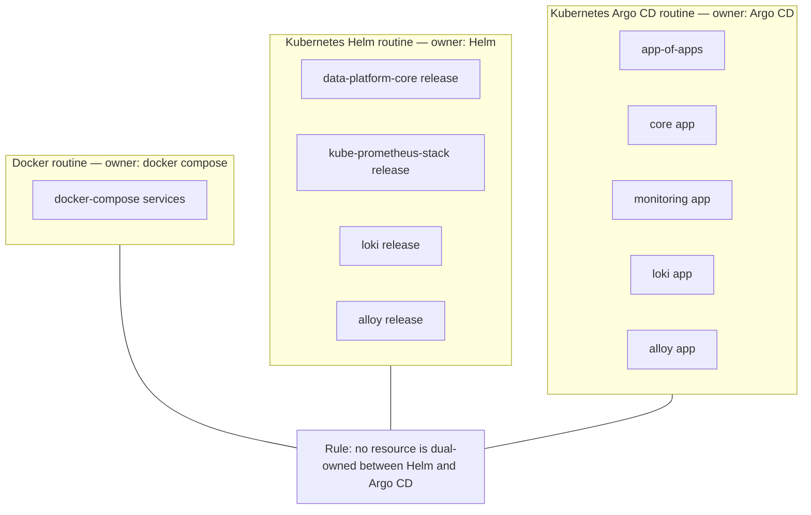
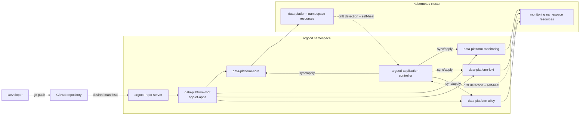
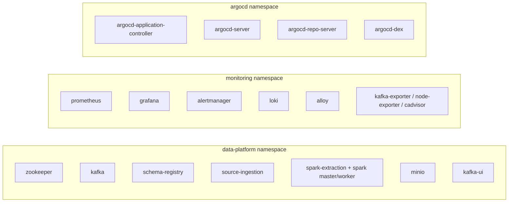

# Architecture

## How To Read This Document

- Sections 1-3 explain design intent and observability component roles.
- Sections 4-6 describe telemetry/data flow and SRE signal mapping.
- Sections 7-10 describe ownership, GitOps behavior, and runtime topology.
- Section 11 links to canonical external references.

## 1. Design Idea

### Observability Vs Monitoring

**Monitoring** answers known questions: "Is this service up? Is disk below 90%?" It detects known unknowns.

**Observability** goes further: given only the data a system produces, can you understand its internal state and debug problems you didn't anticipate — the unknown unknowns? It doesn't just tell you a pipeline is slow; it helps you trace which Spark stage, which Kafka partition, or which schema mismatch started the degradation and when.

This project is structured around observability, not just monitoring:

- Run a realistic data pipeline and observability stack using repeatable routines.
- Keep deployment ownership explicit so routine execution is deterministic.
- Keep observability declarative so dashboards, datasources, and alerts survive restarts and resets.

### Three Pillars

Observability is built on three signal types. This project covers two fully and leaves the third as a future extension:

| Pillar | Tooling | Status |
| --- | --- | --- |
| Metrics | Prometheus + exporters | Implemented |
| Logs | Alloy → Loki | Implemented |
| Traces | OpenTelemetry → Tempo | Future extension |

### Design Principles

1. **Telemetry-first operations**: metrics, logs, and alerts are first-class deliverables, not afterthoughts.
2. **Pull model for metrics**: Prometheus scrapes targets on a schedule; services expose `/metrics`. This makes liveness detection implicit — a failed scrape is itself a signal.
3. **Deterministic routines**: Docker, Helm, and Argo CD routines are explicit and testable.
4. **Clear ownership boundaries**: each deployment path has a clearly defined owner; no resource is managed by two control planes simultaneously.
5. **Alert on symptoms, not causes**: alert when users are impacted (error rates, latency SLOs), not when a CPU hits 80%. Pager fatigue undermines operations.
6. **Docs-as-operations**: architecture, routines, and runbook stay synchronized.

### Non-Goals

- This project does not currently implement full distributed tracing in the runtime stack.
- This project does not prescribe one mandatory production deployment topology.
- This document does not replace the incident runbook for operational execution.

## 2. Prometheus Ecosystem Roles

Prometheus is not a single application; it is an ecosystem of four cooperating components:

| Component | Nickname | Responsibility |
| --- | --- | --- |
| Prometheus Server | The Brain | Pull-scrapes targets, stores TSDB, evaluates PromQL rules |
| Exporters | The Translators | Convert non-native metrics (Kafka, JVM, OS) into `/metrics` |
| Alertmanager | The Dispatcher | Deduplicates, groups, and routes alert notifications |
| Pushgateway | The Drop Box | Holds metrics from short-lived batch jobs until Prometheus scrapes |

> **Pushgateway note**: use it only for service-level batch jobs (e.g., a nightly Iceberg compaction run). Do not use it for general application monitoring.

## 3. Grafana Building Blocks

Grafana does not store data. It connects to data sources and renders results. Understanding the hierarchy prevents confusion:

| Building block | Role |
| --- | --- |
| Data Source | Configured connection (URL, credentials) to Prometheus or Loki |
| Dashboard | Top-level container; exportable as JSON, importable across environments |
| Panel | Single chart or table inside a dashboard |
| Query | PromQL or LogQL expression sent to the data source |
| Variable | Dropdown placeholder that makes one dashboard work across many targets |

## 4. System Context

## 5. Runtime Telemetry Flow (Pull Model)

## 6. Golden Signals Applied To This Platform

Google SRE defines four golden signals that should be the starting point for any observability setup. This project maps them as follows:

| Golden Signal | Definition | Platform metric examples |
| --- | --- | --- |
| **Latency** | Time to serve a request | Kafka producer latency, Spark stage duration, schema-registry request duration |
| **Traffic** | Demand on the system | `kafka_topic_partition_current_offset` rate, Spark records-per-second |
| **Errors** | Rate of failed requests | Kafka consumer lag spikes, Spark task failure rate, schema-registry error responses |
| **Saturation** | How full the system is | JVM heap usage, Kafka broker disk, MinIO storage utilization, CPU/memory from node-exporter |

> **Cardinality warning**: do not add high-variance labels (user IDs, full URLs, session tokens) to Prometheus metrics. Each unique label combination creates a separate time series; cardinality explosion will exhaust Prometheus memory.

## 7. Deployment Ownership Model

## 8. Argo CD GitOps Routine Flow

## 9. Routine-To-Deployment Mapping

| Routine target | Control plane | Expected deployment behavior |
| --- | --- | --- |
| `routine-up-docker` | Docker Compose | Starts local containers from `docker-compose.yml` |
| `routine-up-helm` | Minikube + Helm | Builds local images and installs Helm releases |
| `routine-up-argocd` | Minikube + Argo CD | Installs Argo CD and syncs app-of-apps |
| `routine-status-*` | Routine-specific | Reports health for the active routine |
| `routine-down-*` | Routine-specific | Stops local stack or minikube profile |

## 10. Kubernetes Deployments By Namespace

## 11. Reference URLs

- Prometheus docs: <https://prometheus.io/docs/introduction/overview/>
- Grafana docs: <https://grafana.com/docs/grafana/latest/>
- Loki docs: <https://grafana.com/docs/loki/latest/>
- Alloy docs: <https://grafana.com/docs/alloy/latest/>
- Argo CD docs: <https://argo-cd.readthedocs.io/en/stable/>
- kube-prometheus-stack chart: <https://github.com/prometheus-community/helm-charts/tree/main/charts/kube-prometheus-stack>
